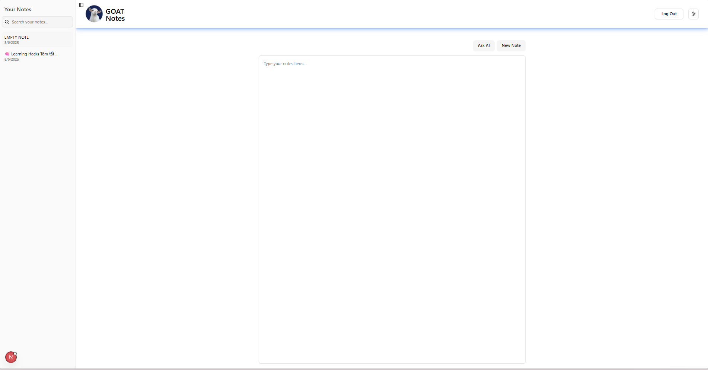

# Project Title

 Full Stack AI Note Taking App with Next.js and Supabase. 


## Acknowledgements

 This project wouldn't be possible without the support and inspiration from the following:

- 🤖 [OpenAI](https://openai.com) – for providing powerful language models that enable natural language understanding and summarization.
- 📝 [Windsurf Editor](https://windsurf.com/editor) – for building a customizable, collaborative editor used in our note interface.
- ⚡ [Vercel](https://vercel.com) – for seamless frontend deployment and hosting.
- 📦 [Supabase](https://supabase.com) – for handling user authentication and real-time database support.

Special thanks to the open-source community for providing countless tools, templates, and knowledge that helped shape this project.

## Authors

- [@baohuy2209](https://github.com/baohuy2209)


## Demo



## Features

- 📝AI Note Summarization
Automatically summarizes long notes into concise bullet points.
Works with manually typed content or imported files.
- 💡AI-Powered Suggestions
Smart suggestions based on the current context of your notes.
- 🔐User Authentication & Real-Time Sync
Secure login system using Supabase or Firebase.
- 🌗Modern UI with Dark/Light Mode
Clean, responsive interface with support for dark and light themes.


## 🚀 About Me
🛠️ I'm currently working on  
Building scalable web applications, implementing automated workflows, and exploring AI model training for real-world applications.

🤝 I'm looking to collaborate on  
Fullstack development projects, custom website designs, blockchain solutions, or anything involving automation with tools like UI Path, n8n, Make, and Zapier.

🆘 I'm looking for help with  
Scaling AI training infrastructure, optimizing low-code automation pipelines, and exploring advanced use cases in blockchain integrations.

🌱 I'm currently learning  
Advanced data analytics with Python and AI model fine-tuning using real-world datasets.

💡 Ask me about  
Freelancing in tech, setting up complex workflow automations, building AI-ready pipelines, or deploying fullstack apps from scratch.

⚡ Fun fact  
I love breaking down complex tech into simple, useful solutions—and I automate everything I can, including coffee reminders ☕⚙️.


## 🛠 Skills
Javascript, HTML, CSS, Nextjs, React Hooks, Supabase


## Installation
Firstly, you need clone this project to local computer: 
```bash
git clone https://github.com/baohuy2209/ai-taking-app.git
```

Install my-project with pnpm

```bash
cd ai-taking-app
pnpm install
```
Then, run project with command 
```bash
pnpm run dev
```
    
## Tech Stack

**Client:** React, TailwindCSS, Nextjs, React Custom Hook, react-markdown

**Server:** Supabase, Nextjs


## Support

For support, email huynguyen002311@gmail.com or contact me by Zalo [0375686583].

